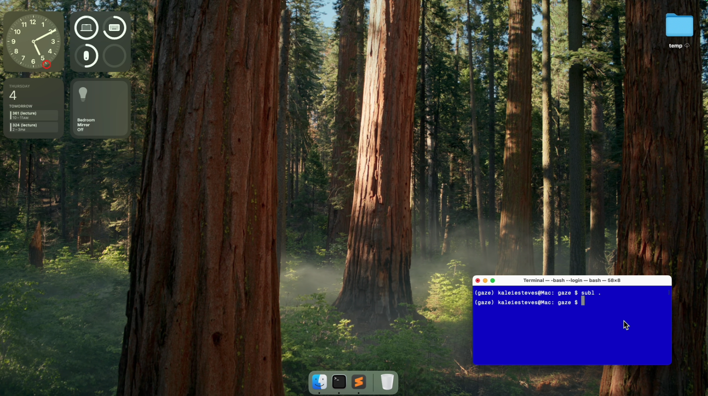
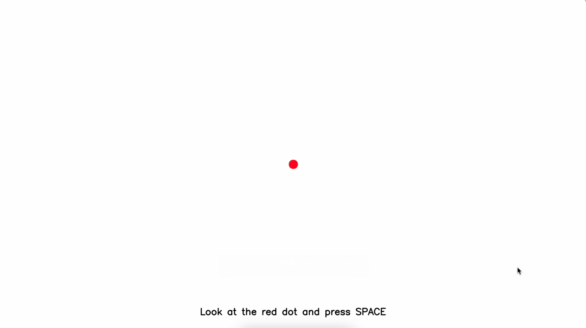

# Gaze
Using MediaPipe to experiment with eye tracking algorithms.




_Note: Not actually on the desktop, this is a screenshot background for testing._

## Project 🌳
```
.
├── environment.yml
├── README.md
└── scripts
    ├── activate.sh
    ├── deactivate.sh
    └── gaze.py
```




### Usage
For Apple Mac Silicon users (M1/M2/Pro/Max), a Conda environment is required for MediaPipe.
```bash
brew install --cask miniconda
```

Then from the project root directory, run:
```bash
conda env create -f environment.yml
```

Then start the environment
```bash
source scripts/activate.sh
```
b
## Commands
1. To open the calibration and camera test use `gaze` in the command line.
2. To exit the environment use `deactivate` in the command line.

### References
- https://www.tobii.com/resource-center/learn-articles/how-do-eye-trackers-work
- https://stackoverflow.com/questions/52940347/convert-eye-gaze-pitch-and-yaw-into-screen-coordinates-where-the-person-is-lo
